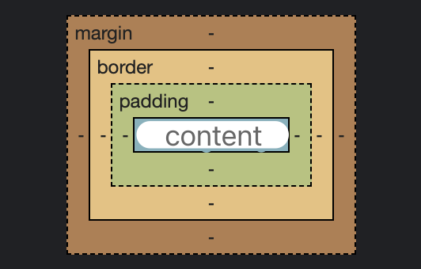

# 文档声明

最近几年开发中，很少再关注文档声明了。

又或者说，很少再关注低版本的 IE 浏览器了，页面中的样式兼容等问题，貌似已经成为历史。

不过也许有一天你会遇到一个开发经验十分丰富的程序员来面试你，又或者接手了一个很有年代的项目，届时也许你会需要了解一下什么是文档声明。

这部分内容稍微不太好记，重点看红色文字部分即可，其他的遇到的时候再查询即可。

### 文档声明的概念

> HTML 文档通常以文档声明开始，该声明的作用是帮助浏览器确定其尝试解析和显示的 HTML 文档类型。

```html

<!DOCTYPE html> 

``` 

:::warning

请始终向 HTML 文档添加 <!DOCTYPE> 声明，这样浏览器才能获知文档类型。

:::

1. 文档声明必须<strong style="color: red;">是 HTML 文档的第一行，且顶格显示</strong>，对大小写不敏感。

```html

<!doctype html> 

``` 
**因为任何放在文档声明之前的东西，比如批注或 XML 声明，会令 IE9或更早的浏览器触发[怪异模式](https://developer.mozilla.org/zh-CN/docs/Web/HTML/Quirks_Mode_and_Standards_Mode)。**

2. <strong style="color: red;">文档声明并非 HTML 标签，它是一条“信息”，告知浏览器期望的文档类型。</strong>

3. <strong style="color: red;"> <!DOCTYPE> 声明没有结束标签。</strong>

4. HTML 发展历史

| 年份 | HTML 版本 |
| ---- | ---- |
| 1991 | HTML |
| 1993 | HTML+ |
| 1995 | HTML2.0 |
| 1996 | HTML3.2 |
| 1999 | HTML4.01 |
| 2000 | XHML1.0 |
| 2014 | HTML5 |

4.1 不同的 HTML 版本主要区别是什么？

+ 支持的 HTML [元素不同](https://www.w3school.com.cn/tags/html_ref_dtd.asp)

所以我们需要通过文档声明告诉浏览器以哪一种文档类型来解析当前的 HTML 文档。

5. 常用的 DOCTYPE 声明

+ <strong style="color: red;"> HTML 5 </strong>

```html

<!DOCTYPE html>

```

+ <strong style="color: red;"> HTML 4.01 Strict </strong>

    该 DTD 包含所有 HTML 元素和属性，但不包括展示性的和弃用的元素（比如 font）。不允许框架集（Framesets）

```html

<!DOCTYPE HTML PUBLIC "-//W3C//DTD HTML 4.01//EN" "http://www.w3.org/TR/html4/strict.dtd">

```

+ <strong style="color: red;"> HTML 4.01 Transitional </strong>

该 DTD 包含所有 HTML 元素和属性，包括展示性的和弃用的元素（比如 font）。不允许框架集（Framesets）。

```html

<!DOCTYPE HTML PUBLIC "-//W3C//DTD HTML 4.01 Transitional//EN" "http://www.w3.org/TR/html4/loose.dtd">

```

+ <strong style="color: red;"> HTML 4.01 Frameset </strong>

该 DTD 等同于 HTML 4.01 Transitional，但允许框架集内容。

```html

<!DOCTYPE HTML PUBLIC "-//W3C//DTD HTML 4.01 Frameset//EN" "http://www.w3.org/TR/html4/frameset.dtd">

```

+ XHTML 1.0 Strict

该 DTD 包含所有 HTML 元素和属性，但不包括展示性的和弃用的元素（比如 font）。不允许框架集（Framesets）。必须以格式正确的 XML 来编写标记。

```html

<!DOCTYPE html PUBLIC "-//W3C//DTD XHTML 1.0 Strict//EN" "http://www.w3.org/TR/xhtml1/DTD/xhtml1-strict.dtd">

```

+ XHTML 1.0 Transitional

该 DTD 包含所有 HTML 元素和属性，包括展示性的和弃用的元素（比如 font）。不允许框架集（Framesets）。必须以格式正确的 XML 来编写标记。

```html

<!DOCTYPE html PUBLIC "-//W3C//DTD XHTML 1.0 Transitional//EN" "http://www.w3.org/TR/xhtml1/DTD/xhtml1-transitional.dtd">

```

+ XHTML 1.0 Frameset

该 DTD 等同于 XHTML 1.0 Transitional，但允许框架集内容。

```html

<!DOCTYPE html PUBLIC "-//W3C//DTD XHTML 1.0 Frameset//EN" "http://www.w3.org/TR/xhtml1/DTD/xhtml1-frameset.dtd">

```

+ XHTML 1.1

该 DTD 等同于 XHTML 1.0 Strict，但允许添加模型（例如提供对东亚语系的 ruby 支持）。

```html

<!DOCTYPE html PUBLIC "-//W3C//DTD XHTML 1.1//EN" "http://www.w3.org/TR/xhtml11/DTD/xhtml11.dtd">

```

:::info

在 HTML 4.01 中，<!DOCTYPE> 声明引用 DTD，因为 HTML 4.01 基于 SGML。DTD 规定了标记语言的规则，这样浏览器才能正确地呈现内容。

HTML5 不基于 SGML，所以不需要引用 DTD。

:::

### 渲染模式

明白了文档声明了之后，我们还需要看一个东西，就是[渲染模式](https://developer.mozilla.org/zh-CN/docs/Web/HTML/Quirks_Mode_and_Standards_Mode)。

浏览器渲染模式分为三种：

+ <strong style="color: red;"> 怪异模式（混杂模式）</strong> [Quirks mode]

    在怪异模式下，排版会模拟 Navigator 4 与 Internet Explorer 5 的非标准行为。为了支持在网络标准被广泛采用前，就已经建好的网站，这么做是必要的。

+ <strong style="color: red;"> 接近标准模式 </strong> [Almost standards mode]

    在接近标准模式下，只有少数的怪异行为被实现。

+ <strong style="color: red;">严格模式（标准模式）</strong> [standards mode]

    在标准模式下，行为即（但愿如此）由 HTML 与 CSS 的规范描述的行为。

对于 HTML 文档来说，浏览器使用文档开头的 DOCTYPE 来决定怪异模式处理或是标准模式处理。

如果文档中没有 DOCTYPE  会触发文档的怪异模式，怪异模式最明显的影响是会触发怪异盒模型。

### 严格模式和怪异模式的部分渲染区别

1. <strong style="color: red;">怪异模式</strong>下盒模型的宽高包含内边距 padding 和边框 border。



在 W3C 中标准中，如果设置一个元素的宽度和高度，指的是元素内容的宽度和高度，而在 IE5.5 及以下的浏览器以及其他版本的**怪异模式**下，元素的宽度和高度还包含了内边距 padding 和边框 border。

2. <strong style="color: red;">怪异模式</strong>下可以设置行内元素的宽与高

在**标准模式**下，给 span 等行内元素设置 width 与 height 都不会生效，而在**怪异模式**下则会生效。

3. <strong style="color: red;">怪异模式</strong>下可设置百分比的高度

在**标准模式**下，一个元素的高度是由其包含的内容来决定的，如果父元素没有设置高度，子元素设置一个百分比的高度是无效的。

4. <strong style="color: red;">怪异模式</strong>下用 margin: 0 auto 设置水平居中在 IE 下会失效。

使用 margin: 0 auto 在**标准模式**下可以让元素水平居中，但在**怪异模式**下却会失效。

```css

/* 解决方案 */
body{
    text-align:  center;
}
#target{
    text-align: left;
}

```

5. <strong style="color: red;">怪异模式</strong>下设置图片的 padding 会失效。

6. <strong style="color: red;">怪异模式</strong>下 Table 中的字体属性不会继承上层的设置。

7. <strong style="color: red;">怪异模式</strong>下 white-space: pre 会失效。