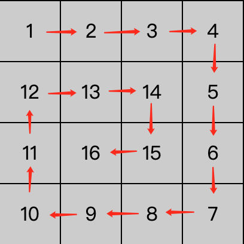

# 🌀 旋涡二维数组

先来看一张示意图：



数字按照一个旋涡的形式显示，如果我们将这种图形转化为数据，最好的就是一个二维数组。

```js

// 为了效果好看，将数据进行了纵向对其。
[
    [1,  2,  3,  4],
    [12, 13, 14, 5],
    [11, 16, 15, 6],
    [10, 9,  8,  7],
]

```

那么问题来了，如何封装一个函数，能够根据需要生成旋涡二维数组呢？

1. 根据图片效果，我们可以发现，需要生成一个旋涡二维数组，至少需要两个参数：
    + 设横向为 row ，表示内部数组每一项的长度；
    + 设纵向为 col ，表示外围数组的长度；
    
    这样我们就能生成一个 row 行 * col 列的数组。

2. 那 row， col是否有最小值限制呢？ 
    
   从数据的角度 row, col 只要是正整数，我们就能生成一个数组。所以 row， col 要为大于 0 的整数；
    
现在让我们开始尝试写一下代码。

1. 根据参数生成二维数组

```js

/*
 * @param { number } row 行
 * @param { number } col 列 
 * @return { array } arr 二维数组
 */

function vortex( row, col ){
    // 第一步 判断参数
    if( row ){

    }
}

```
