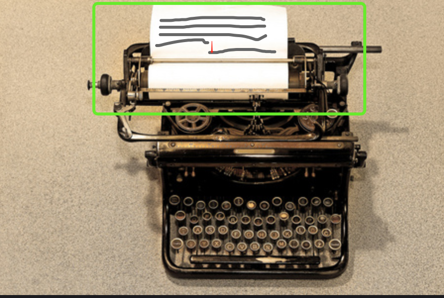

# \r\n

这个转义符不用多介绍了吧?

算了，还是说一下吧。

<strong style="color: red;"> \r </strong> 是回车

<strong style="color: red;"> \n </strong> 是换行

当我们需要在一段长字符串中指定换行位置的时候，会像下面这样写：

```js

console.log('今古恨，几千般，只应离合是悲欢？\r\n 江头未是风波恶，别有人间行路难！');

```

你一定猜到我要问：“回车和换行是一个意思，写一个就行了呗，为啥写俩？”

嗯...对也不对，对是问题问对了，可你想的答案不是我想要的~

你肯定要说是为了兼容 Windows 系统呀，Linux 系统啥的吧？

那不同系统出现差异的历史原因是啥呢？

我知道，听我来巴巴。


图例这是啥知道不？

对，打字机，我也没见过真的。

以前的打字机也有换行和回车，不过换行和回车表达的实际效果是不一样的。

换行是在指定位置纵向移动到下一行。如下图，灰色部分表示文字，红色箭头表示换行后的位置。



回车呢是在中断位置回到当前行的起点。如下图，箭头方向表示回车后的位置。


所以，由于这个历史原因，导致各个系统在实现换行和回车的有些差异，也和我们现在对换行和回车的认知有些差异。

为了兼容这种差异性，编程人员在开发的过程中，会同时使用 \r\n。