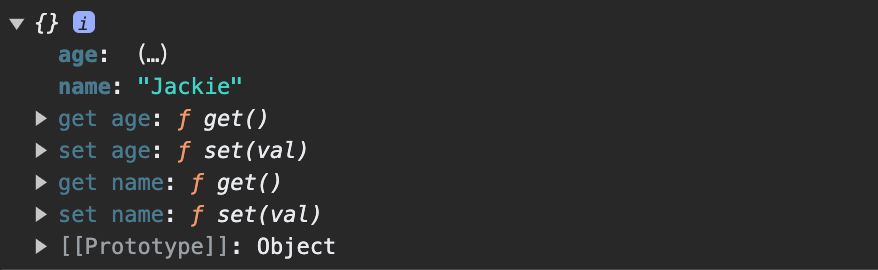
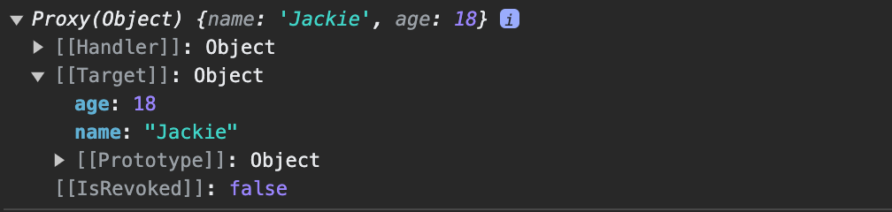

# Vue2 和 Vue3 差异 —— 响应式数据实现原理

自从 Vue3.0 发布以后，大家对其高度赞扬，性能更高了，代码组织更合理了，响应式数据不易丢失了...等等，那这些到底都是为什么呢？

今天就来简单的记录一下我学习的结果 —— 响应式数据实现原理差异。

大家都知道 Vue2.0 响应式数据是通过 ``` Object.defineProperty ```对数据进行劫持来监听用户读写行为的。

让我们通过小段代码看一下底层实现。

- 首先，让我们回忆一下在 Vue2.0 中我们是如何定义变量的：

```js
// 写法一：
new Vue({
    el: '#app',
    data: {
        name: 'Jimmy'
    }
});

// 写法二：
new Vue({
    el: '#app',
    data(){
        return {
            name: 'Jackie'
        }
    }
});

```

我们需要将变量全部都写在一个```data```对象，然后 Vue2.0 将这里的数据进行进一步的处理，来实现响应式的目的。

- 那么，我们就来看看响应式数据是如何实现的。

我们需要定义一个观察者函数，用来监听数据是否发生了变化。

```js
/*
 * 观察者函数
 * @param { Object } Observee 需要被监听的对象
 */
const observer = (Observee) => {
    const monitor = {}; // 第一步：定义一个空对象，用来对监听对象进行属性复制和劫持
    const props = Object.keys(Observee); // 第二步：取出监听对象的全部属性
    for (const prop of props) { // 第三步 遍历监听对象的具体属性
        Object.defineProperty(monitor, prop, { // 第四步：复制并劫持数据读写
            get() { // 监听数据的读出
                console.log('Reading: You are hijacked!');
                return Observee[prop];
            },
            set(val) { // 监听数据的写入
                console.log('Writing: You are hijacked!');
                Observee[prop] = val;
            }
        })
    }
    return monitor; // 通过 Object.defineProperty 以后，将复制劫持后的对象返回
}

```

通过一小段代码来验证我们的观察者函数：

```js

// 这里是我们的原始数据
const original = {
    name: 'Jimmy',
    age: 18
};

// 这里是被底层处理过并重新返给我们的数据
const hijacked = observer(original); 

// 这里我们触发了get函数，会输出： Reading: You are hijacked! 和 Jimmy
console.log(hijacked.name); 

// 在这里我们重新赋值 会触发set函数 然后输出： Writing: You are hijacked!
hijacked.name = 'Jackie'; 

// 这里的输出结果让我们看下面的图片
console.log(hijacked); 

```

控制台输出的 hijacked 对象，可以看出 age 属性是 ...，这是因为age已经变为一个函数了，需要点开的时候才能够执行，返回结果。 name属性展开后也已经被修改了。



当然，这是简易版本的响应式数据，Vue2.0 还要做更多的事情。这里我们只是为了和 Vue3.0 的代理模式进行一个对比。


Vue2.0 的响应式数据大概有一个了解之后，我们再看一下 Vue3.0 是如何使用```Proxy```代理来实现数据的响应式的。

- 老样子，我们先来看一下 Vue3.0 中是如何定义变量的。

```js

// 方法一：和 Vue2.0 一样继续使用，使用选项式API，依然用 data

// 方法二: 简单数据类型
const name = ref('Jimmy');
const age = ref(18);

// 方法三: 复杂数据类型
const person = reactive({
    name: 'Jimmy',
    age: 18
})

```

当然，方法二和方法三并不是等价的，我们在这里只是展示一下变量定义的差异。

Vue3.0 使用代理的方式来监听数据，那我们也来简单模仿一下：

```js

/*
 * 观察者函数
 * @param { Object } Observee 需要被监听的对象
 */
const observer = (Observee) => {
    const proxy = new Proxy(Observee, {
        get(Observee, prop) {
            return Reflect.get(Observee, prop); // 读：通过底层的 Reflect 反射函数来得到被监听对象的值
        },
        set(Observee, prop, value) {
            Reflect.set(Observee, prop, value); // 写：通过底层的 Reflect 反射函数来修改被监听对象的值
        }
    });
    return proxy; 
}

```

依旧通过一小段代码来验证我们的观察者函数：

```js

// 这里是我们的原始数据
const original = {
    name: 'Jimmy',
    age: 18
};

// 这里是被底层处理过并重新返给我们的数据
const hijacked = observer(original); 

// 这里我们触发了get函数，会输出：Jimmy
console.log(hijacked.name); 

// 在这里我们重新赋值 会触发set函数
hijacked.name = 'Jackie'; 

// 这里的输出结果让我们看下面的图片
console.log(hijacked); 

```

我们可以看到，控制台输出的数据外面有一层 Proxy。也就是说我们看到的数据，已经被处理过了。




#### 总结

- 从代码实现上我们可以看出，代理模式的代码更加简易；

- ```Object.defineProperty```的实现方式，需要在内部创建一个新的对象，造成了不必要的内存空间浪费。而Proxy的代理模式则没有这个问题。相信这也是Vue3.0性能更有的一个重要原因吧。

- ```Object.defineProperty```的实现方式在初期就将原始对象的key都遍历了一遍进行监听，但是当原始对象有新的属性被添加的时候，就会出现失去响应的问题，这也是在Vue2.0中给对象添加新属性为什么要调用 $set 的原因。Vue3.0的代理模式，完美的解决了这个问题。